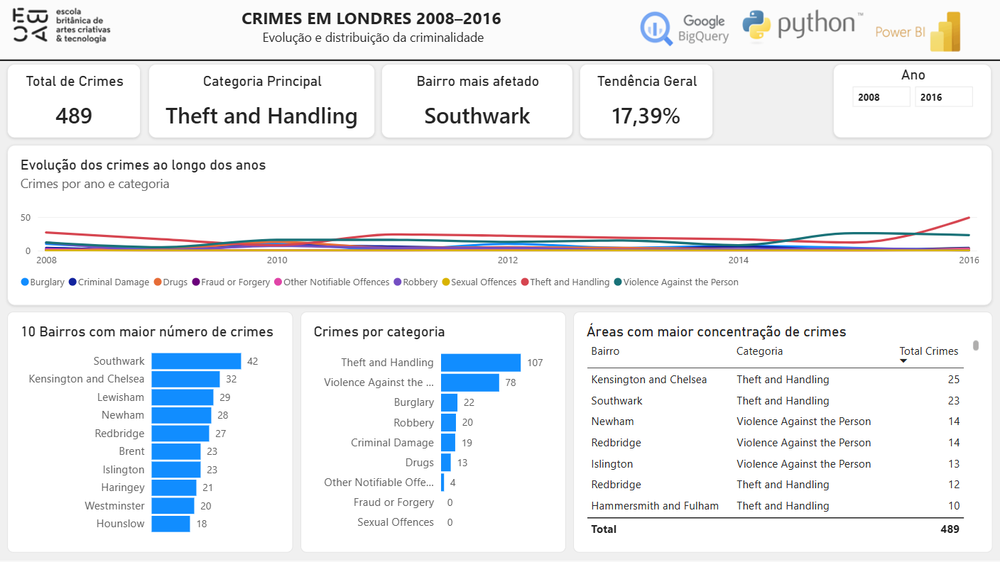

# London Crime Analysis

Análise de registros de criminalidade em Londres utilizando **Google BigQuery, Python e Power BI**, com foco na evolução dos crimes ao longo do tempo e na distribuição dos registros por categoria e bairro.

## 📊 Dashboard

> A imagem do dashboard será adicionada ao repositório após a finalização do projeto.



## 🎯 Objetivo

O projeto busca responder à seguinte pergunta:

> **Quais tipos de crime estão crescendo ou diminuindo ao longo do tempo em Londres, em quais bairros há maior concentração de registros e onde podem ser observadas áreas que merecem maior atenção preventiva?**

A análise considera registros do período de **2008 a 2016**.

## 🛠️ Tecnologias utilizadas

- **Google BigQuery** — armazenamento, consulta e exploração dos dados
- **SQL** — extração e validação dos dados
- **Python** — conexão com o BigQuery, extração e tratamento dos dados
- **Pandas** — manipulação e preparação dos dados
- **Power BI** — modelagem, análise e visualização
- **Git/GitHub** — versionamento e documentação do projeto

## 🔄 Pipeline do projeto

```text
London Crime Dataset
        ↓
     BigQuery
        ↓
      SQL
        ↓
     Python
        ↓
 Tratamento e validação
        ↓
     Power BI
        ↓
    Dashboard
```

## 🗂️ Estrutura do projeto

```text
crime-london/
│
├── README.md
│
├── scripts/
│   └── conexao_bigquery_london_crime.py
│
├── data/
│   ├── raw/
│   │   └── crime_london_raw.csv
│   └── ready/
│       └── crime_london_ready.csv
└── dash/
    └── london_crime_dashboard.pbix
    └── dashboard_overview.png
```

## ☁️ BigQuery

O projeto utiliza o Google Cloud BigQuery para consultar a base pública de crimes de Londres.

Projeto utilizado:

```text
crimelondon-508704
```

Tabela utilizada:

```text
Crime_London_amostra.crime_lsoa_amostra2016
```

A tabela de análise contém uma amostra de **1.000 registros**, utilizada para fins acadêmicos e para construção do dashboard.

## 🐍 Python

O script Python estabelece a conexão com o BigQuery, executa consultas SQL e realiza validações e tratamento dos dados.

Principais etapas:

- conexão com o BigQuery;
- extração dos dados;
- validação da quantidade de registros;
- verificação de valores nulos;
- validação de tipos e valores;
- verificação de meses inválidos;
- verificação de valores negativos;
- verificação de registros duplicados;
- padronização dos dados;
- exportação dos dados tratados.

## 📈 Análises realizadas

O dashboard foi desenvolvido para analisar:

### Evolução temporal

Identificação das categorias de crimes que apresentam crescimento ou redução ao longo dos anos.

### Distribuição por categoria

Comparação do volume de registros entre as diferentes categorias de crimes.

### Distribuição por bairro

Identificação dos bairros com maior concentração de registros na amostra analisada.

### Áreas de maior concentração

Análise conjunta de bairro e categoria para identificar onde existe maior volume de registros.

## ⚠️ Sobre os dados

Este projeto utiliza uma **amostra de 1.000 registros** da base de crimes de Londres para fins de estudo.

Por isso, os resultados apresentados no dashboard representam **a amostra analisada** e não devem ser interpretados como uma representação completa da criminalidade atual de Londres.

Além disso, volume de registros não representa necessariamente risco, gravidade ou incidência populacional. As conclusões devem ser interpretadas dentro das limitações da base utilizada.

## 📁 Dados

Os arquivos de dados utilizados no projeto não são disponibilizados integralmente neste repositório quando seu tamanho ou origem tornam isso inadequado.

O processo de extração e tratamento pode ser consultado no script Python disponível em:

```text
scripts/conexao_bigquery_london_crime.py
```

## 👤 Projeto

Projeto desenvolvido como parte do curso de **Analista de Dados da EBAC**, utilizando ferramentas de cloud, programação e Business Intelligence.
